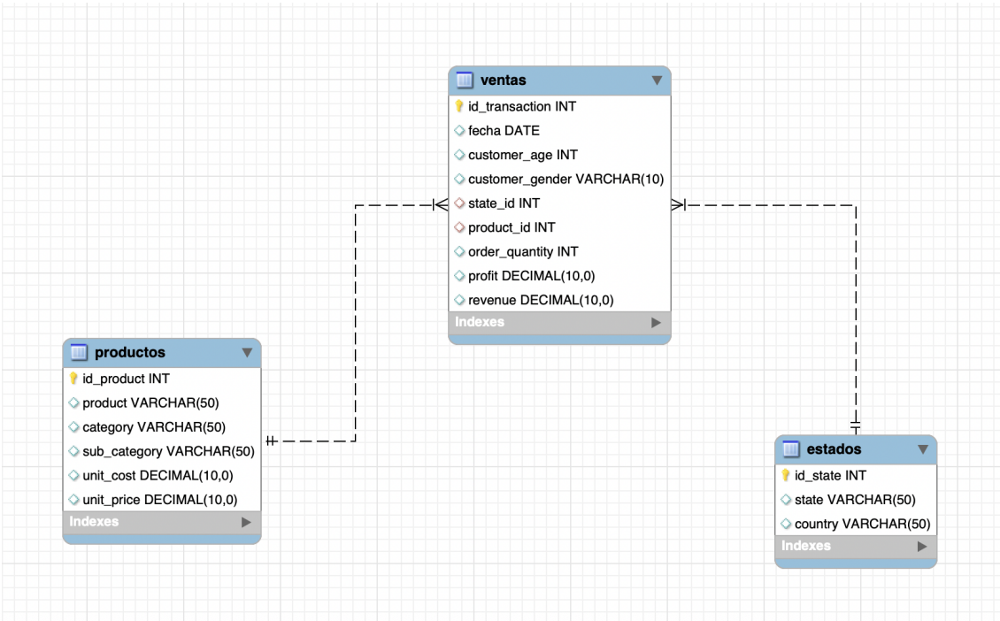

  

<h1 align="center">Venta de bicicletas en Europa - SQL</h1>
 
## Descripción

El proyecto se encuentra actualmente en desarrollo como parte del curso **SQL Flex** dictado por **CoderHouse**. Para su implementación, se utiliza como fuente de datos la base disponible en Kaggle:[Bike Sales in Europe]([https://www.kaggle.com/datasets/sadiqshah/bike-sales-in-europe/data])

## Introducción
El dataset almacena datos relacionados con la venta de bicicletas en países europeos. Incluye información sobres transacciones de ventas, características demográficas de los clientes, detalles de los productos vendidos y aspectos financieros de las ventas.

El **objetivo principal** del proyecto consiste en desarrollar consultas SQL que permitan analizar de forma integral la información del dataset sobre ventas debicicletas. Este análisis buscará cubrir aspectos clave de carácter financiero, logístico ycomercial. La finalidad es obtener conclusiones útiles para la toma de decisiones estratégicas y operativas, aprovechando la base de datos como una herramienta transversal a diferentes áreas de la organización.

## Situación problemática
Actualmente, la información de ventas se encuentra dispersa y no estructurada en un formato que facilite el análisis eficiente. Esto dificulta la obtención de métricas clave, la comparación entre períodos y la identificación de oportunidades de negocio. La implementación de una base de datos relacional permitirá centralizar la información, optimizar los tiempos de consulta, y reducir brechas de información.

## Modelo de negocio
El proyecto está destinado a una empresa multinacional dedicada a la fabricación y comercialización de bicicletas y accesorios, con operaciones en diversos países. Su modelo de negocio se basa en la venta directa a consumidores finales y en la distribución a minoristas. La mantiene un catálogo diversificado que abarca desde bicicletas de gama básica hasta modelos premium, así como accesorios especializados.

El acceso a información detallada sobre clientes, productos y transacciones permite a la organización optimizar su inventario, diseñar campañas de marketing segmentadas, mejorar su estrategia de precios y garantizar una logística eficiente.

## Diagrama entidad-relación
El diagrama relaciona la tabla ventas con la tabla productos y la tabla estados. 

Una venta está asociada a un único producto pero un producto puede estar asociado a múltiples ventas (relación muchos a uno).
Una venta se realiza en un único estado pero un estado puede estar asociado a múltiples ventas (relación muchos a uno).

[Ver Diagrama entidad-relación(Diagrama entidad-relación.mwb)

  

